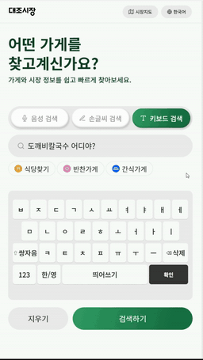
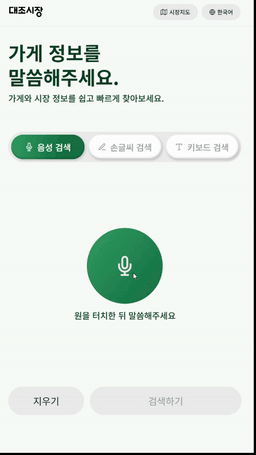
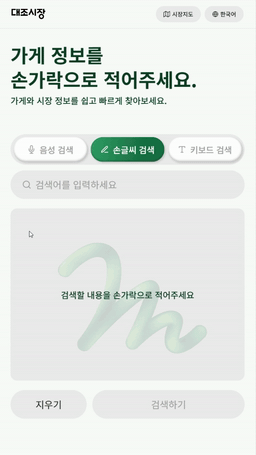

# 대조시장 안내 키오스크

키보드·음성·손글씨로 대조시장 가게를 검색하고 위치를 안내하는 키오스크 프로젝트입니다. 관리자 화면에서 가게 정보, 검색 태그, 홍보 콘텐츠와 운영 모드를 관리할 수 있습니다.

## 디자인

[대조시장 키오스크 Figma 디자인](https://www.figma.com/design/3xrSPYkr4uPY67YAmpSu9t/-RISE--%25EB%258C%2580%25EC%25A1%25B0%25EC%258B%259C%25EC%259E%25A5-%25ED%2582%25A4%25EC%2598%25A4%25EC%258A%25A4%25ED%2581%25AC_forme?node-id=1-1080&p=f&t=LGkeRNxInXBd6eO0-0)

## 시연 영상

미리보기 이미지를 클릭하면 소리가 포함된 원본 영상으로 이동합니다.

| 키보드 검색 | 음성 검색 | 손글씨 검색 |
| :---: | :---: | :---: |
| [](docs/키보드.mp4) | [](docs/음성.mp4) | [](docs/손글씨.mp4) |
| [원본 영상 보기](docs/키보드.mp4) | [원본 영상 보기](docs/음성.mp4) | [원본 영상 보기](docs/손글씨.mp4) |

## 주요 기능

- **가게 검색 및 길 안내**: 키보드·음성·손글씨 입력과 시장 지도를 제공합니다.
- **다국어 안내**: 한국어·영어·베트남어를 지원하며, 저장한 가게 정보와 검색 태그를 Argos로 자동 번역합니다.
- **관리자 화면**: 가게명·설명·태그·썸네일, 검색 태그와 홍보 콘텐츠를 관리합니다.
- **운영 모드 전환**: 길찾기와 홍보 모드를 전환합니다.
- **로컬 AI 실행**: llama.cpp 언어 모델, 음성 인식, Qwen TTS와 Windows 손글씨 인식 서버를 연결합니다.

## 프로젝트 구성

| 경로 | 역할 |
| --- | --- |
| `frontend/ml-test-main` | Vite 사용자 키오스크와 함께 배포되는 관리자 화면 |
| `admin-frontend` | 공유 관리자 화면을 사용하는 별도 Next.js 앱 |
| `backend` | Spring Boot API 서버와 관리자 인증 |
| `ai-server` | Flask AI 서버와 로컬 언어 모델 연동 |
| `ai-server/argos-translate-server` | 영어·베트남어 자동 번역 서버 |
| `ai-server/qwen-tts-server` | Qwen 음성 합성 서버 |
| `handwriting-server` | Windows 손글씨 인식 서버 |
| `docs` | 기능별 시연 영상과 README 미리보기 |
| `run-all.ps1` | 로컬 서비스 통합 실행 스크립트 |
| `run-server.ps1` | Vercel 테스트용 실행 및 Cloudflare 터널 스크립트 |

## 실행 환경

- Windows와 PowerShell
- Node.js와 npm
- Java 20
- MySQL 및 백엔드 연결 설정
- Python 가상환경: `ai-server/.venv`, `ai-server/argos-translate-server/.venv`
- .NET SDK 및 Windows 손글씨 인식 환경
- 로컬 언어 모델과 Qwen TTS 실행 파일·모델
- Vercel 테스트 모드 사용 시 `cloudflared` 설치 및 PATH 등록

번역 서버 설치는 [Argos 설치 안내](ai-server/argos-translate-server/README.md), 음성 합성 설정은 [Qwen TTS 안내](ai-server/qwen-tts-server/README.md)를 참고하세요.

## 의존성 설치

아래 명령은 레포지토리 루트에서 순서대로 실행합니다. Python 가상환경과 모델은 먼저 준비해야 합니다.

```powershell
npm.cmd install
npm.cmd --prefix frontend/ml-test-main install
npm.cmd --prefix admin-frontend install
```

```powershell
cd ai-server
.\.venv\Scripts\python.exe -m pip install -r requirements.txt
cd argos-translate-server
.\.venv\Scripts\python.exe -m pip install -r requirements.txt
.\.venv\Scripts\python.exe -X utf8 install_models.py
cd ..\..\backend
.\gradlew.bat dependencies --configuration runtimeClasspath
cd ..
```

## 로컬 실행

레포지토리 루트에서 실행합니다.

```powershell
npm.cmd run dev:local
```

`npm.cmd run dev`도 같은 명령입니다. 실행 스크립트는 번역 서버가 준비된 뒤 백엔드를 시작하고, 로컬 언어 모델·음성 합성·AI·손글씨 인식·프론트엔드를 함께 실행합니다.

실행 창을 유지하고, 종료할 때는 해당 창에서 `Ctrl+C`를 누르세요. 이 실행에서 새로 시작한 서비스들이 함께 종료됩니다. 기존에 실행 중이던 서비스는 재사용합니다. 로그는 `.local-service-logs/`에 저장됩니다.

| 서비스 | 주소 |
| --- | --- |
| 사용자 키오스크 | http://localhost:5173 |
| 키오스크에 포함된 관리자 화면 | http://localhost:5173/dashboard |
| 별도 관리자 앱 | http://localhost:3000 |
| 백엔드 | http://localhost:8080 |
| AI 서버 | http://localhost:8000 |
| 로컬 언어 모델 | http://localhost:8010 |
| 음성 합성 | http://localhost:8020 |
| 손글씨 인식 | http://localhost:17832 |
| 자동 번역 | http://localhost:17834 |

### 관리자 모드 전환 및 로그인

- **사용자 → 관리자**: 왼쪽 위 대조시장 로고를 첫 클릭부터 **1초 안에 5번** 누르면 관리자 화면이 새 탭으로 열립니다.
- **관리자 → 사용자**: 키오스크에 포함된 관리자 화면에서 로고를 **연속 5번** 누르면 같은 탭에서 사용자 화면으로 돌아갑니다. 클릭 간격이 1.5초를 넘으면 횟수가 초기화됩니다.
- **기본 로그인**: 아이디 `daejo_admin`, 비밀번호 `2580`입니다.

localhost에서는 위 계정으로 데모 로그인이 가능합니다. 배포 화면에서는 백엔드의 실제 관리자 인증을 사용합니다. 백엔드를 시작할 때 해당 계정이 없으면 비밀번호를 BCrypt로 암호화하여 생성합니다. 기존 계정과 비밀번호는 유지합니다.

배포 화면에서 기본 계정을 사용하려면 계정 생성 코드가 포함된 백엔드를 실행해야 합니다. **Vercel 프론트엔드만 재배포해도 백엔드 계정이 생성되는 것은 아닙니다.** Vercel에 로그인용 환경변수를 추가할 필요는 없습니다.

백엔드 환경변수로 초기 계정 생성을 설정할 수 있습니다.

| 환경변수 | 기본값 | 용도 |
| --- | --- | --- |
| `KIOSK_ADMIN_USERNAME` | `daejo_admin` | 새 계정의 아이디 |
| `KIOSK_ADMIN_PASSWORD` | `2580` | 새 계정의 비밀번호 |
| `KIOSK_ADMIN_BOOTSTRAP_ENABLED` | `true` | `false`로 설정하면 초기 계정 생성 중지 |

## 프론트엔드 환경변수

로컬 개발 시 `frontend/ml-test-main/.env`를 설정합니다.

```env
VITE_API_URL=http://localhost:8080
VITE_GPT_API_URL=http://localhost:8000
```

키오스크 빌드에 `/login`과 `/dashboard`가 포함되어 있어 사용자·관리자 화면을 같은 도메인에서 제공할 수 있습니다. 관리자 화면도 동일한 `VITE_API_URL`을 사용합니다.

`VITE_ADMIN_URL`은 별도 관리자 사이트로 연결할 때만 설정하세요. 같은 사이트의 관리자 화면을 사용하려면 설정하지 않습니다.

## Vercel 배포 및 로컬 서버 연결

Vercel 프로젝트의 **Root Directory**를 `frontend/ml-test-main`으로 설정합니다. `frontend`를 루트로 사용하는 경우에도 해당 폴더의 빌드 설정을 사용할 수 있습니다.

배포된 화면에서 현재 PC의 백엔드와 AI 서버를 호출하려면 레포지토리 루트에서 실행합니다.

```powershell
npm.cmd run dev:server
```

번역 서버를 백그라운드에서 먼저 실행하고, 백엔드·AI·손글씨 인식·사용자 프론트엔드·관리자 앱을 각각 PowerShell 창에서 실행합니다. 백엔드와 AI 서버에는 Cloudflare 터널을 연결합니다.

실행 후 출력되는 주소를 **Vercel 프로젝트의 환경변수에 그대로 입력**하세요.

```env
VITE_API_URL=https://xxxxx.trycloudflare.com
VITE_GPT_API_URL=https://yyyyy.trycloudflare.com
```

환경변수를 변경한 뒤에는 반드시 다시 배포해야 합니다. Cloudflare 터널을 새로 만들면 주소가 달라질 수 있으므로, 이전 주소를 계속 사용하지 않도록 확인하세요. 터널 로그는 `.cloudflared-logs/`에 저장됩니다.

손글씨 검색도 `VITE_API_URL`을 사용합니다. 백엔드가 `/api/handwriting/recognize` 요청을 로컬 인식 서버로 전달하므로 별도의 손글씨 터널이나 Vercel 환경변수는 필요하지 않습니다. 인식 서버가 다른 PC에서 실행된다면 백엔드의 `HANDWRITING_SERVICE_URL`을 설정하세요.

## AI 서버 환경변수

AI 서버는 `ai-server/.env`를 읽으며, 기본적으로 로컬 llama.cpp 서버를 사용합니다.

```env
LOCAL_LLM_BASE_URL=http://127.0.0.1:8010/v1
LOCAL_LLM_MODEL=local-gemma
```

로컬 모델 실패 시 OpenAI 폴백을 사용하려면 `OPENAI_API_KEY`를 추가합니다. 로컬 모델만 사용할 경우 필수 항목은 아닙니다.

```env
OPENAI_API_KEY=<OpenAI API 키>
```

## 자동 번역

가게 정보와 검색 태그를 저장하면 영어·베트남어 번역을 함께 저장합니다. Argos 서버는 `http://127.0.0.1:17834/health`에서 준비 상태를 확인할 수 있습니다.

상호명은 의미를 임의로 바꾸지 않도록 로마자 표기와 한글을 병기합니다. 설명과 일반 문장은 번역 모델을 사용합니다. 번역 서버가 꺼져 있으면 한국어와 기존 번역은 유지되며, 번역 서버를 켠 뒤 다시 저장하거나 백엔드를 재시작하면 미완료 번역을 재시도합니다.

## 서비스 종료

- **로컬 모드**: 통합 실행 창에서 `Ctrl+C`를 누르면 해당 실행이 시작한 서비스들을 종료합니다.
- **Vercel 테스트 모드**: 실행한 서비스 창들을 종료합니다. 번역 서버와 Cloudflare 터널은 백그라운드 프로세스이므로 필요할 때 별도로 종료하세요.
- 기존 프로세스가 포트를 사용하고 있다면 해당 프로세스를 확인한 뒤 종료하고 다시 실행하세요.

## 파일 관리

- `.env`와 Python 가상환경, 모델·캐시, 서비스 로그는 Git 제외 설정을 확인하고 관리합니다.
- `docs`의 원본 MP4와 `docs/previews`의 GIF를 함께 커밋해야 README의 시연 영상이 표시됩니다.
- `frontend/ml-test-main/vite.config.ts`는 개발 시 `.trycloudflare.com` 호스트 접근을 허용합니다.
